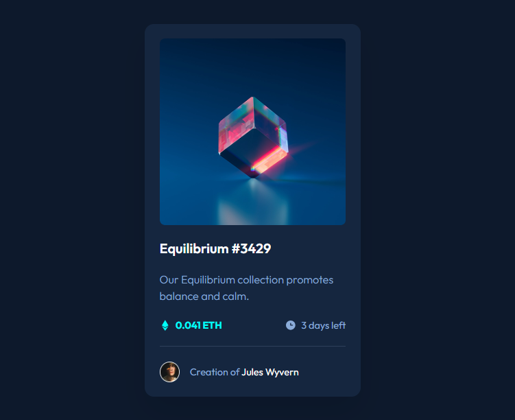

# NFT preview card component - Frontend Mentor challenge

This preview card is a small component-presentation of the product with its description and details about its owner-creator.

## Navigation

- [Overview](#overview)
  - [Screenshot](#screenshot)
  - [Main task](#main-task)
  - [Built With](#built-with)
  
- [Conclusions](#сonclusions)
  - [What have I achieved](#what-have-i-achieved)
- [More about me](#more-about-me)

## Overview

### Screenshot

### Main task

Your challenge is to build out this preview card component and get it looking as close to the design as possible.

You can use any tools you like to help you complete the challenge. So if you've got something you'd like to practice, feel free to give it a go.

Your users should be able to:

- View the optimal layout depending on their device's screen size
- See hover states for interactive elements

### Built With

- HTML5 mark-up
- CSS3 styles
- Flexbox

## Conclusions

There were no difficulties, so I'm moving at my own pace!

### What have I achieved

While creating this component, I realized that I had already started to get used to structuring components and working on styles faster. Better organization of work and a step-by-step plan.

## More about me

You can find my personal website with a portfolio of my work at the link https://solvixcode.com/

- GitHub https://github.com/Olha-Fursova
- LinkedIn https://www.linkedin.com/in/olha-fursova-6727b7265/
- Frontend Mentor https://www.frontendmentor.io/profile/Olha-Fursova
- Twitch https://www.twitch.tv/solvixcode/